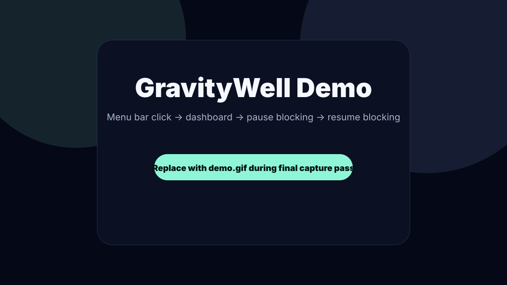
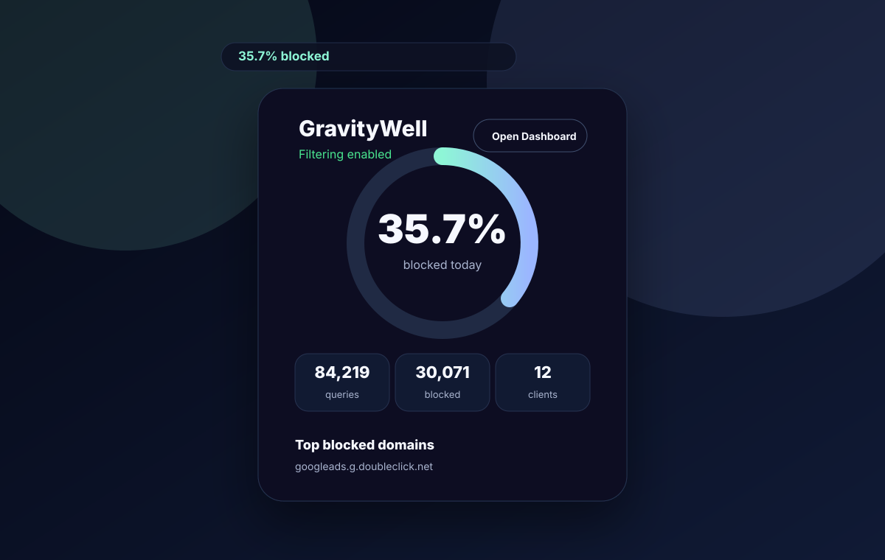
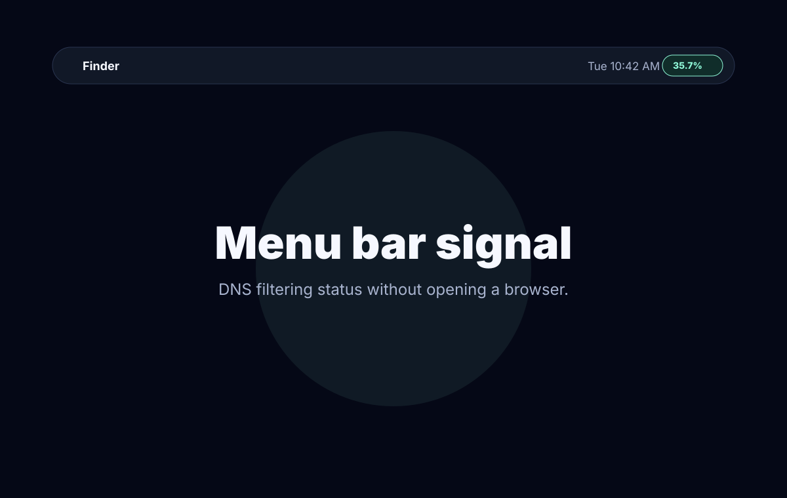
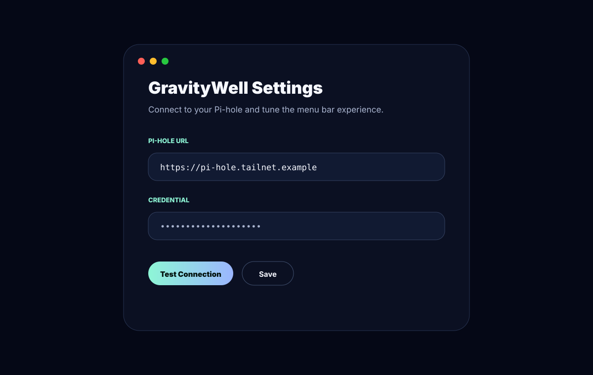
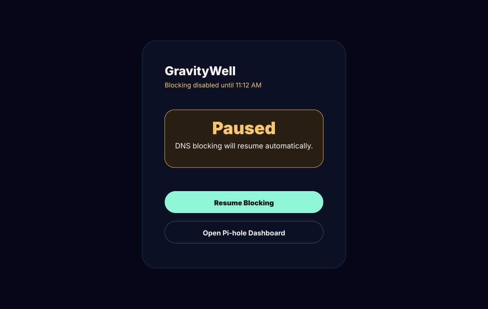

# GravityWell

Native macOS menu bar companion for Pi-hole.

[](https://github.com/zacharyreece/gravitywell/actions/workflows/build.yml)
[](LICENSE)


Monitor DNS filtering, top blocked domains, top clients, and network activity directly from your menu bar.

Built for homelabs, Tailscale networks, and privacy enthusiasts.



## Features

- Live DNS statistics
- Block percentage tracking
- Top blocked domains
- Top clients
- Last-hour query activity sparkline
- Pause and resume blocking
- Native SwiftUI menu bar interface
- Tailscale-friendly LAN/VPN support
- HTTPS support with opt-in self-signed certificate trust
- Credentials stored in macOS Keychain
- Local-first operation
- No telemetry

## Screenshots

| Dashboard | Menu Bar |
| --- | --- |
|  |  |

| Settings | Blocking Paused |
| --- | --- |
|  |  |

Final v1.0 PNG screenshots and `demo.gif` should replace these launch placeholders during the capture pass.

## Installation

### Homebrew

```sh
brew tap zacharyreece/gravitywell
brew install --cask gravitywell
```

### Direct Download

1. Download `GravityWell.dmg` from the [latest release](https://github.com/zacharyreece/gravitywell/releases/latest).
2. Open the DMG.
3. Drag GravityWell to Applications.
4. Launch GravityWell.
5. Enter your Pi-hole URL and credential.
6. Done.

Target setup time: under 1 minute.

## Configuration

1. Launch GravityWell.
2. Open Settings from the menu bar popover.
3. Enter your Pi-hole base URL, for example `https://pi-hole.local` or a Tailscale HTTPS URL.
4. Enter a Pi-hole password or application password.
5. Use Test Connection to verify authentication and summary fetching.
6. Save the connection.

GravityWell targets Pi-hole v6+ first. If your Pi-hole account requires 2FA, generate and use an application password where possible.

## Pi-hole API Support

Current API support:

- `POST /api/auth`
- `GET /api/stats/summary`
- `GET /api/stats/top_domains`
- `GET /api/stats/top_clients`
- `GET /api/network/devices`
- `GET /api/clients`
- `GET /api/clients/_suggestions`
- `GET /api/dhcp/leases`
- `GET /api/queries`
- `POST /api/dns/blocking`

## Privacy

GravityWell is designed as a local-first utility for private networks.

- No telemetry
- No analytics
- No cloud services
- No external requests except the configured Pi-hole instance
- Credentials stored in macOS Keychain
- Session IDs stored in memory only
- Session IDs sent with `X-FTL-SID`, not query parameters
- Non-sensitive settings stored in UserDefaults
- Self-signed TLS certificates rejected by default
- Self-signed TLS certificates accepted only when explicitly enabled

See `SECURITY.md` for more detail.

## Website

The landing page lives in `website/` and is built with Vite, React, TypeScript, and MUI.

```sh
cd website
npm install
npm run dev
```

Production site: `https://gravitywell.app`

Sparkle appcast feed: `https://gravitywell.app/appcast.xml`

## Development

Build:

```sh
xcodebuild -project GravityWell.xcodeproj -scheme GravityWell -configuration Debug -destination 'platform=macOS' build
```

Test:

```sh
xcodebuild -project GravityWell.xcodeproj -scheme GravityWell -configuration Debug -destination 'platform=macOS' test
```

## Project Structure

```text
GravityWell/
├── .github/
│   ├── ISSUE_TEMPLATE/
│   ├── workflows/
│   └── pull_request_template.md
├── Assets/
│   ├── screenshots/
│   ├── gifs/
│   └── logo/
├── GravityWell/
│   ├── App/
│   ├── Assets/
│   ├── Models/
│   ├── Providers/
│   ├── Services/
│   ├── Utilities/
│   └── Views/
├── GravityWellTests/
├── website/
├── CHANGELOG.md
├── CONTRIBUTING.md
├── LICENSE
├── QA_CHECKLIST.md
├── RELEASE_CHECKLIST.md
├── ROADMAP.md
├── SECURITY.md
└── README.md
```

## Roadmap

See `ROADMAP.md`.

Near-term launch focus:

- Signed and notarized DMG
- Sparkle auto-updates
- Homebrew Cask personal tap
- Final screenshots and GIF
- Vercel deployment for `gravitywell.app`

Future direction:

- Historical graphs
- Query explorer
- Multiple Pi-hole support
- Notifications
- Tailscale integration
- Home Assistant integration
- Homelab service-provider architecture

## Contributing

See `CONTRIBUTING.md`.

## Security

Please report vulnerabilities through GitHub private vulnerability reporting. See `SECURITY.md`.

## License

MIT. See `LICENSE`.
